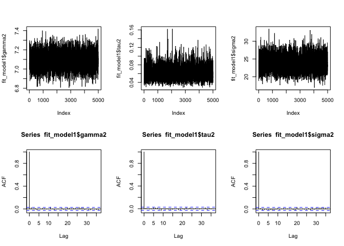
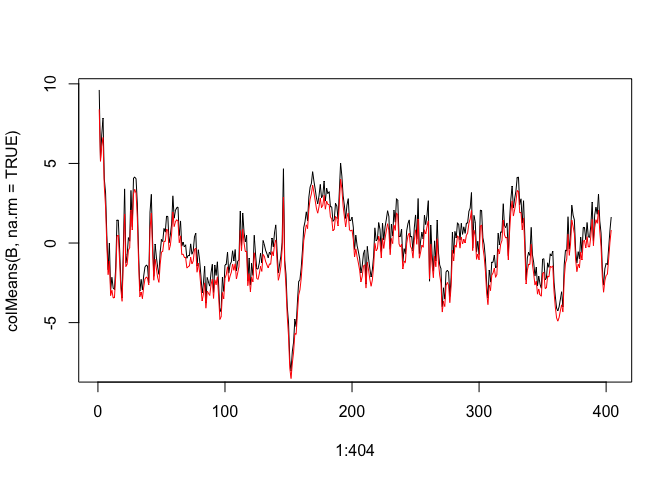

# Model 1
Alessia Caponera, Francesco Denti, Tommaso Rigon, Andrea Sottosanti and Alan Gelfand  


First of all, we load the necessary data in memory. The data matrix `B` is composed by

- The observations belonging to the first hemisphere (regions from 1 to 35).
- The `10`-th subject.
- The first scan, that is, `k=1`.


```r
rm(list=ls())

# This load the dataset "Y"
load("../Dataset/fMRI-ROI-time-series.RData") 
# Location and names of the Desikan atlas
ROI  <- read.table("../Dataset/ROI-covariates.txt",header=TRUE)
# Information on subjects
SUBJ <- read.table("../Dataset/SUBJ-covariates.txt",header=TRUE)

# This is the selected dataset
B <- Y[1:35,,10,1]
```

The matrix `D` computed below contains the euclidean distances among centroids. Again, we retained only the first `35` regions. In the `W` matrix we stored instead the **proximity matrix** for the CAR prior. The parameters `k1` and `k2` are selected so that the maximum off-diagonal values are between `0.1` and `1`.


```r
D  <- as.matrix(dist(subset(ROI, select=c(centroid_x,centroid_y,centroid_z))))[1:nrow(B),1:nrow(B)]

index_D   <-  matrix(TRUE,nrow(D),nrow(D)); diag(index_D)<- FALSE
d_lower   <- min(D[index_D])
d_upper   <- max(D[index_D])

k1        <- 10^(d_lower/(d_upper - d_lower))
k2        <- log(k1)/d_lower
W         <- k1*exp(-k2*D); diag(W) <- 0
```

The prior distributions are specified using the following list


```r
prior <- list(psi=3/100,              # Scale parameter for the GP
              sigma2_0 = 10^4,        # Variance of the intercept
              a_sigma2=1, b_sigma2=1, # Inverse-Gamma hyperparameters for sigma2
              a_gamma2=1, b_gamma2=1, # Inverse-Gamma hyperparameters for gamma2
              a_tau2=1, b_tau2=1      # Inverse-Gamma hyperparameters for tau2
              )
```


## The Gibbs sampling

In the following, the MCMC chain is computed. We remark that it could be quite time consuming.


```r
source("model1.R")

set.seed(123)
# Attention! This part will require a lot of time
fit_model1  <- Gibbs_model1(B=B, W=W, prior=prior, 
                            R=5000, burn_in=500, thinning=5, verbose=TRUE)

# Remove the 25% of values 
index <- sample(nrow(B)*ncol(B),floor(0.25*length(B)))
B_NA <- B; B_NA[index] <- NA 

fit_model1_NA  <- Gibbs_model1(B=B_NA, W=W, prior=prior, 
                            R=5000, burn_in=500, thinning=5, verbose=TRUE)
save.image("model1.RData")
```


## Diagnostic graphs: autocorrelations and traceplots


```r
par(mfrow=c(2,3))

# Autocorrelations
plot(fit_model1$gamma2,type="l")
plot(fit_model1$tau2,type="l")
plot(fit_model1$sigma2,type="l")

# Autocorrelations of hyperparameters
acf(fit_model1$gamma2)
acf(fit_model1$tau2)
acf(fit_model1$sigma2)
```

<!-- -->

```r
par(mfrow=c(1,1))
```


```r
plot(1:404,colMeans(B,na.rm = TRUE),type="l")
lines(1:404,colMeans(fit_model1$Z),col="red")
```

<!-- -->


```r
# # Additive model MSE
# pred_additive <- matrix(0,35,403)
# 
# for(l in 1:35){
#   pred_additive[l,] <- mean(fit_out_additive$beta_0 + fit_out_additive$phi[,l]) + colMeans(fit_out_additive$Z)
# }
# 
# plot(c(pred_additive),c(B))```
# 
# 
# ## Predictive performance - Out of sample prediction
# 
# 
```
