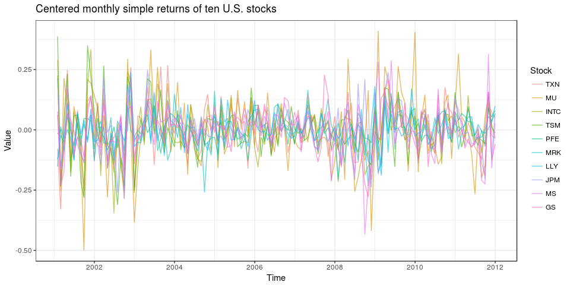
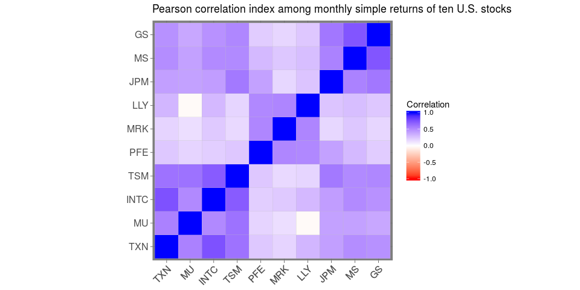
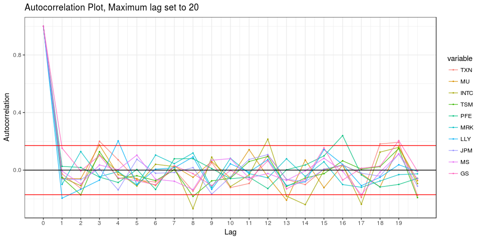
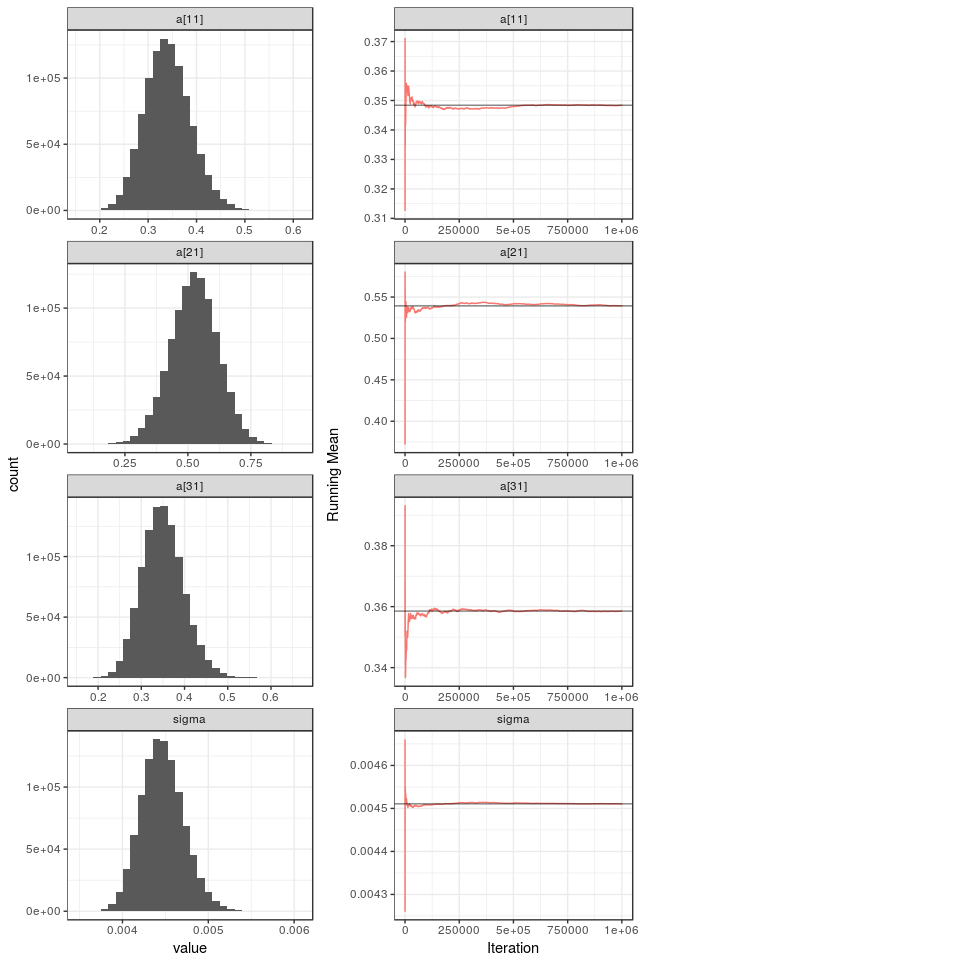
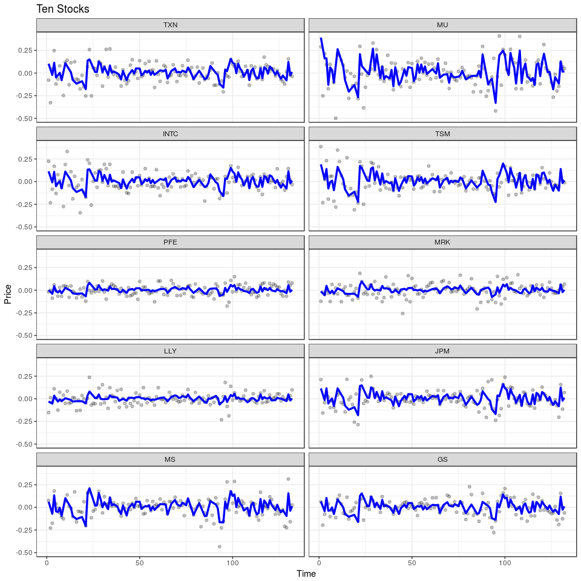
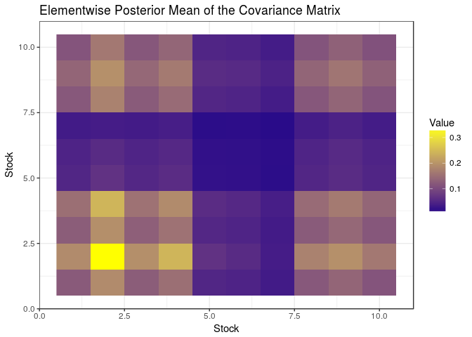

# Hierarchical spatio-temporal modeling of multivariate time series data


## Introduction

In this tutorial we apply the statistical methodology developed in the paper Caponera et al. (2018), _Hierarchical spatio-temporal modeling of resting state fMRI_ to the `tenstocks` financial dataset, which is available in the R package `MTS`. 
Motivated by rs-FMRI data, the paper describes a flexible and parsimonious model for areally-referenced time series. In various applications a neighborhood matrix is not available and which distance to use is not always a simple choice. To avoid this difficulty, their model does not rely on any concept of distance. This assumption makes the model robust with respect to the definition of distance, and hence allows to apply our methodology to different types of data. One simple example of the  structures that our model is able to handle is given by _multivariate time series_.

We use the model to describe the relationships among the time series, providing as output an estimate of the covariance matrix, which could be useful for interpreting the phenomenon under study.

## Explorative data analysis

To testify the adaptability of model, we apply our setting to describe the covariance structure among ten time series, referring to simple monthly returns of ten U.S. stocks. As already mentioned,  the dataset `tenstocks` is available in the package `MTS`. First of all, since our model was developed for zero-mean time series, we center the data. Let us have a glimpse of our data with the following plot

```r
# This load the dataset
data("mts-examples")

# Creation of the dataset
dd <- as.character(tenstocks[,1])
dd <- as.Date(dd,"%Y %m %d")
tenstocks <- as.data.frame(apply(tenstocks[,-1],2,function(x) scale(x, center = T, scale = F)))
tenstocks$date <- dd

# Plot
data.plot <- melt(tenstocks,id.vars = "date")
colnames(data.plot) <- c("Time","Stock","Value")
data.plot <- as.tibble(data.plot)
ggplot(data=data.plot, aes(x=Time,y=Value,group=Stock)) + geom_line(alpha=0.60,aes(col=Stock)) + theme_bw() + xlab("Time") + ylab("Value") +ggtitle("Centered monthly simple returns of ten U.S. stocks")
```

<!-- -->

One can describe the correlation structure computing the Pearson correlation coefficient among time series. An example is reported in the following raster plot.  Spurious correlation, arised by time dependency, could be present in this first result.  To support our last claim, we report also the estimated autocorrelation functions. 

<!-- --><!-- -->

From the correlation matrix, it seems that there are two "clusters" of highly correlated time series. Moreover, some kind of autocorrelation seems to be present among the ten stocks series. 

## Pre-processing of the `tenstocks` dataset

We prepare the data for being processed by our model, and we import the functions used for estimation, which are available at the link [`functions.R`](#).

```r
source("functions.R")
tenstocks   <- t(tenstocks)
n_t   <- ncol(tenstocks)             # Number of time observations
n_l   <- nrow(tenstocks)             # Number of generated processes
colnames(tenstocks) <- 1:n_t;        # Set the names of the colums
time  <- seq(0,ncol(tenstocks),length=ncol(tenstocks))
```

In order to perform in-sample prediction we create two mutually exclusive grids of points. The `tenstocks` dataset is then splitted into two parts: training and test.

```r
set.seed(123)
time_grid <- sort(sample(n_t,round(0.75*n_t))) # The 75% of the time columns are used.
new_grid  <- setdiff(1:n_t,time_grid)          # Grid for prediction
tenstocks_train <- tenstocks[,time_grid]
tenstocks_test  <- tenstocks[,new_grid]
```

## Model estimation

After having splitted the data into train and test dataset, we first run `15000` iterations and we discard `5000` of them as burn-in period, thinning the chain every `5` iterations, for `K = 2,3,4`. The code for the estimation is omitted.


|  K|         DIC|    p|     p_DIC|  Acceptance_ratio|        MAP|  RMSE_train|  RMSE_test|
|--:|-----------:|----:|---------:|-----------------:|----------:|-----------:|----------:|
|  2|   -3885.103|   20|   21.0772|            0.3822|   1899.061|      0.0610|     0.1246|
|  3|   -3877.990|   28|   24.2548|            0.0914|   1874.409|      0.0595|     0.1250|
|  4|   -3873.144|   35|   22.5673|            0.0685|   1840.482|      0.0533|     0.1279|

Computational issues seem to arise as `K` increases. The best choice of `K` according to the DIC criterion is `K=2`. We run again a longer MCMC chain fixing `K=2`. In particular, the number of simulations is set to `1000000`, the thinning is set to `5` and the burn-in period is of `250000` observations. As an example, we report the Monte Carlo markov Chains for the parameters: `a[1,1], a[2,1], a[2,2]` and for `sigma`.

<!-- -->

## Posterior results

The prediction on the test dataset is performed. We then have a look at the resulting plots for a qualitative assessment. The model seems to capture the mean of the process.

<!-- -->

Let us have a look to the raster plot which describes the estimated covariance matrix. Notiche that the estimation is built averaging each component of the matrix along the simulated chain.

<!-- -->
