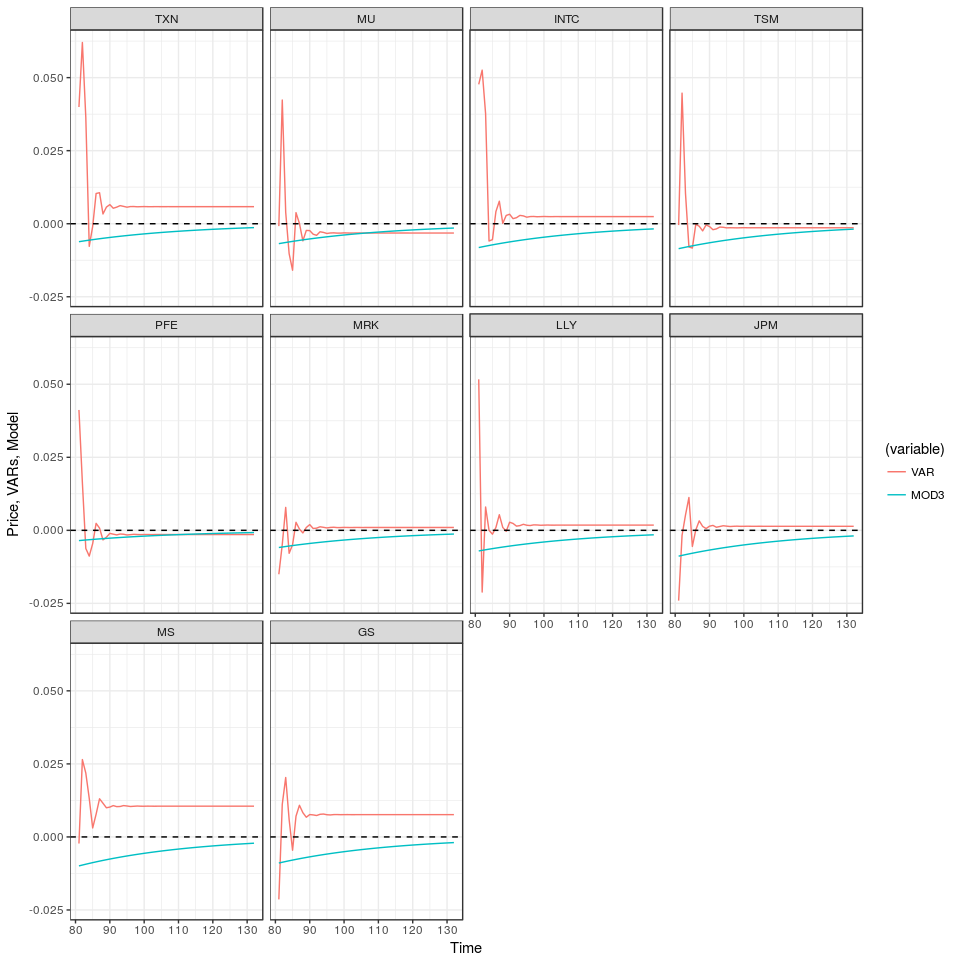

# Hierarchical spatio-temporal modeling multivariate time series data


## Introduction
In this repository we apply the statistical methodology developed in the paper Caponera et al. (2018), ***Hierarchical spatio-temporal modeling of resting state fMRI*** to a financial dataset, which is available in the R package `MTS`. 
Motivated by rs-FMRI data, the paper provides a flexible and parsimonious setting for areally-referenced time series. Since in various applications a neighborhood matrix is not available and the idea of which distance to use is not always completely clear, our model does not rely on any distance concept. This assumption makes our model robust with respect to the definition of distance, and hence allows us to apply our methodology to different types of data. One simple example of the  structures that our model is able to handle is given by ***multivariate time series***.
More precisely, we use our model to describe the relationships among the time series, providing as output an estimate of the covariance matrix which could be useful for interpreting the phenomenon under study.

## Data Analysis

To testify the adaptability of model, we apply our setting to describe the covaraince structure among ten time series, referring to simple monthly returns of ten U.S. stocks. As already stated,  The dataset `tenstocks` is available in the package `MTS`. First of all, since our model was developed for zero-mean time series, we center the data. Let us have a glimpse of our data with the following plot.

<!-- -->

One can naively describe the correlation structure computing the Pearson Correlation Coefficient. An example is reported in the following raster plot. 
Spurious correlation, arised by time dependency, could be present in this first result. However, this matrix could be a useful benchmark. 
To support our last claim, we report also the ACF plots (in a time series form, to improve interpretability). 

<!-- --><!-- -->

From the correlation matrix, two ``clusters'' of highly correlated time series appear. Moreover, even if it is not so remarkable, some kind of autocorrelation seems to be present among the ten stocks. We then prepare the data for being processed by our model and we import our functions. 


```r
source("functions.R")
DAT   <- t(DAT)
n_t   <- ncol(DAT)             # Number of time observations
n_l   <- nrow(DAT)             # Number of generated processes
colnames(DAT) <- 1:n_t;        # Set the names of the colums
time  <- seq(0,ncol(DAT),length=ncol(DAT))
```

In order to perform in-sample prediction we create two mutually exclusive grids of points. The `DAT` dataset is then splitted into two parts: training and test.


```r
set.seed(123)
time_grid <- sort(sample(n_t,round(0.75*n_t))) # The 75% of the time columns are used.
new_grid  <- setdiff(1:n_t,time_grid)          # Grid for prediction
DAT_train <- DAT[,time_grid]
DAT_test  <- DAT[,new_grid]
```

After having splitted the data into train and test dataset, we firstly run 15000 iterations and we discard 5000 of them as burn-in period (thinning step of 5 observations) for $K\in\{2,3,4\}$, as suggested by the previous exploratory plots.

|  K|         DIC|    p|     p_DIC|  Acceptance_ratio|        MAP|  RMSE_train|  RMSE_test|
|--:|-----------:|----:|---------:|-----------------:|----------:|-----------:|----------:|
|  2|   -3885.103|   20|   21.0772|            0.3822|   1899.061|      0.0610|     0.1246|
|  3|   -3877.990|   28|   24.2548|            0.0914|   1874.409|      0.0595|     0.1250|
|  4|   -3873.144|   35|   22.5673|            0.0685|   1840.482|      0.0533|     0.1279|

Computational issues seem to arise as `K` increases. The best choice of $K$ according to the DIC criterion is `K=2`. We run again a longer MCMC chain fixing `K=2`. In particular, the number of simulations is set to `1000000`, the thinning is set to `5` and the burn-in period is of `250000` observations. As an example, we report the Monte Carlo markov Chains for the parameters: `a[1,1], a[2,1], a[2,2]` and for `sigma`.


<!-- -->

The prediction on the test dataset is performed. We then have a look at the resulting plots for a qualitative assessment. The model seems to capture the mean of the process.

<!-- -->

Let us have a look to the raster plot which describes the estimated covariance matrix. Notiche that this estimation is built averaging each component of the matrix along the simulated chain.

<!-- -->

We want compare the Out-of-sample performance of our model (`MOD3`) with the prediction ability of VAR model. To do so, we create new training and testing datasets, splitting the temporal line at `t=80`. The models are trained on the first eighty observations and then they are use to forecast the future `52` prices.

We run a MCMC simulation on the new training set. The values are left identical to the ones of the previous example.

The next plot shows the predicitons for the mean of the various processes. It seems to be a little more stable than the one predicted by the VAR. Moreover, recall that the time series have been standardized. We would expect that the predictions that one performs tend to converge to the mean of the process, as the time index shifts far away from the available data and less information is available. 
This desirable property can be appreciated in our model, as we can see in the plot below. The VAR model, on the other hand, for some of the time series seems to be more affected by the noise (e.g. TXN, MS).

<!-- -->

Finally, we can state that our model does a slightly better job in comparison with a model well suited for time series. In fact, the MSE of the VAR model is given by `0.010923` while our model scores an MSE of `0.0107293`. 
